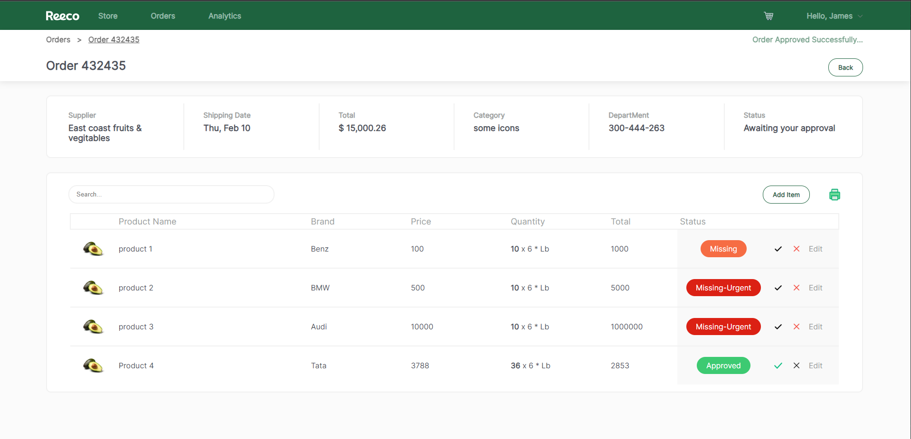

This is project is created for the frontend interview assesment from CAW studios.

Problem statement: https://drive.google.com/drive/folders/1yGWs1hFkMS0NxPGGyLIX9j5YgKSaMzuB

Hosted App: https://reeco-chandra-manikandan.netlify.app/

# Project Stack

1. React Js
2. Typescript
3. Redux & Redux-thunk
4. Styled Components

# To run

1. Run: npm run dev
2. build: npm run build

# Project Outputs:

